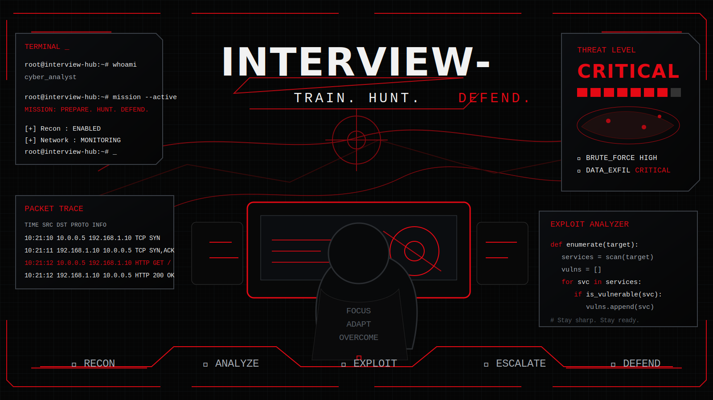
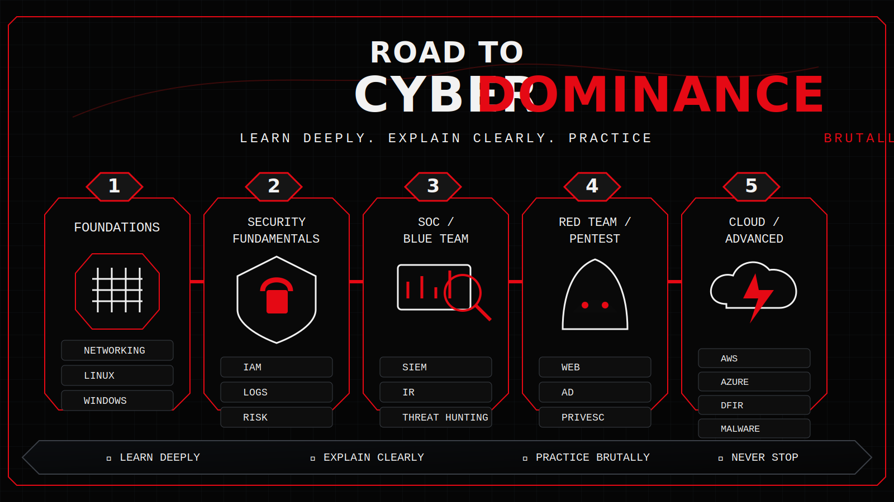
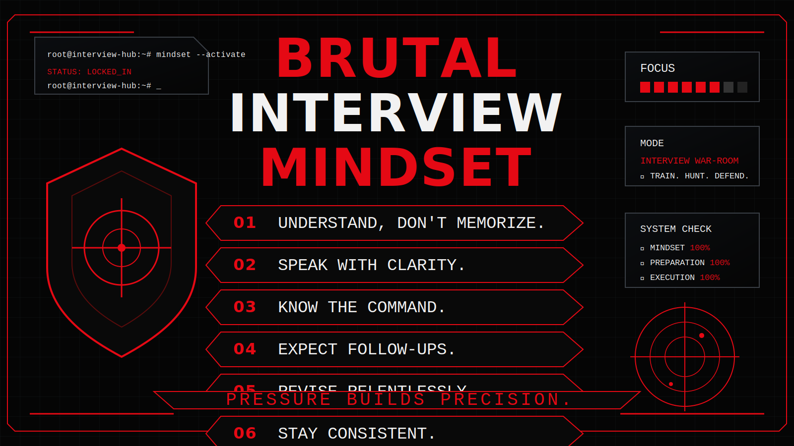

<div align="center">


<br>

# Interview-Hub

### Cyber Security Interview Preparation — Structured. Practical. Relentless.

<p>
  <b>Target: 5000+ Cyber Security Interview Questions</b><br>
  Networking • Linux • Windows • Active Directory • Web Security • Cloud • SOC • DFIR • Red Team • Blue Team • Malware Analysis • OSINT • GRC • Python • Cryptography
</p>

<br>


<br>

> **No random dumps. No weak explanations. No fake preparation.**  
> This repository is built to help you answer cyber security interview questions with clarity, confidence, technical depth, and practical command knowledge.

</div>

---

## Mission

**Interview-Hub** is a structured cyber security interview preparation repository built for people who want to become sharp, confident, and technically dangerous in interviews.

This is not just a question bank.

This is a preparation system.

It is designed to help you:

- Understand the concept
- Explain it clearly
- Handle follow-up questions
- Connect theory with real-world security work
- Remember key points quickly
- Use practical commands where needed
- Prepare for technical, HR, scenario-based, and domain-specific interviews

> **Learn deeply. Explain clearly. Practice brutally. Stay dangerous.**

---

## Built For

This repository is useful for:

| Audience | Use Case |
|---|---|
| Students | Placement and internship preparation |
| Freshers | Cyber security fundamentals and HR questions |
| SOC Analysts | SIEM, logs, alerts, incident response, threat hunting |
| Penetration Testers | Web, network, Linux, Windows, Active Directory, privilege escalation |
| Red Teamers | Adversary mindset, attack paths, lateral movement concepts |
| Blue Teamers | Detection, defense, monitoring, response |
| DFIR Professionals | Forensics, investigation, evidence, timelines |
| Cloud Security Engineers | AWS, Azure, GCP, IAM, cloud misconfigurations |
| GRC Professionals | Risk, compliance, policies, controls |
| Bug Bounty Hunters | Web security, API security, recon, reporting |
| Experienced Professionals | Job switch and senior-level revision |

---

## Why Interview-Hub Is Different

Most interview repositories are just lists.

Interview-Hub is built differently.

| Feature | Description |
|---|---|
| Structured Format | Every question follows a professional answer format |
| Interview-Ready Answers | Answers are written the way you should speak in interviews |
| Technical Deep Dives | Concepts are explained beyond basic definitions |
| Real-World Examples | Each topic connects to real security work |
| Practical Commands | Commands are included where they are useful |
| Follow-Up Questions | Helps you survive interviewer cross-questioning |
| Common Mistakes | Shows what candidates usually get wrong |
| Quick Revision | Short summaries for fast revision |
| Difficulty Levels | Beginner to expert progression |
| Domain Tags | SOC, Red Team, Blue Team, Cloud, DFIR, GRC, Bug Bounty |

---

<div align="center">



</div>

---

## Repository Structure

```text
Interview-Hub
│
├── README.md
├── CONTRIBUTING.md
├── LICENSE
│
├── assets
│   ├── cyber-interview-ripper-banner.svg
│   ├── terminal-war-room.svg
│   ├── cyber-roadmap.svg
│   └── brutal-mindset.svg
│
├── Networking
│   ├── Basic Networking.md
│   ├── Advanced Networking.md
│   ├── TCP-IP.md
│   ├── DNS.md
│   ├── HTTP.md
│   ├── HTTPS.md
│   ├── Routing.md
│   └── VPN.md
│
├── Linux
│   ├── Linux Basics.md
│   ├── Linux Commands.md
│   ├── Linux Internals.md
│   ├── Bash.md
│   ├── Process Management.md
│   ├── System Calls.md
│   ├── SSH.md
│   └── Linux Security.md
│
├── Windows
├── Active Directory
├── Web Security
├── API Security
├── OWASP Top 10
├── Cryptography
├── Malware Analysis
├── Digital Forensics
├── Incident Response
├── Threat Hunting
├── SIEM
├── Splunk
├── Azure Sentinel
├── Cloud Security
├── AWS
├── Azure
├── GCP
├── Docker
├── Kubernetes
├── DevSecOps
├── Python
├── OSINT
├── Bug Bounty
├── Red Team
├── Blue Team
├── SOC
├── Reverse Engineering
├── Mobile Security
├── Wireless Security
├── Wireshark
├── Nmap
├── Burp Suite
├── Metasploit
├── CTF
├── HR Questions
├── Resume Questions
└── Interview Experiences
```

---

## Difficulty Levels

| Level | Label | Meaning |
|---|---|---|
| ⭐ | Beginner | Basic concept every candidate should know |
| ⭐⭐ | Easy | Common interview-level concept |
| ⭐⭐⭐ | Intermediate | Requires technical understanding |
| ⭐⭐⭐⭐ | Advanced | Requires real-world or operational knowledge |
| ⭐⭐⭐⭐⭐ | Expert | Deep technical, scenario-based, or senior-level |

---

## Current Coverage Plan

| Category | Status | Target |
|---|---:|---:|
| Networking | Available | 300+ Questions |
| Linux | Available | 300+ Questions |
| Windows | Available | 300+ Questions |
| Active Directory | Available | 400+ Questions |
| Web Security | Planned | 500+ Questions |
| API Security | Planned | 250+ Questions |
| OWASP Top 10 | Planned | 250+ Questions |
| SOC | Planned | 400+ Questions |
| SIEM | Planned | 250+ Questions |
| Splunk | Planned | 150+ Questions |
| Microsoft Sentinel | Planned | 150+ Questions |
| Incident Response | Planned | 300+ Questions |
| Digital Forensics | Available | 300+ Questions |
| Threat Hunting | Planned | 250+ Questions |
| Cloud Security | Planned | 400+ Questions |
| AWS | Planned | 250+ Questions |
| Azure | Planned | 250+ Questions |
| GCP | Planned | 150+ Questions |
| Red Team | Planned | 350+ Questions |
| Blue Team | Planned | 350+ Questions |
| Malware Analysis | Planned | 250+ Questions |
| Reverse Engineering | Planned | 200+ Questions |
| OSINT | Planned | 200+ Questions |
| GRC | Planned | 200+ Questions |
| Python | Planned | 200+ Questions |
| HR Questions | In Progress | 100+ Questions |
| Resume Questions | Planned | 100+ Questions |
| Interview Experiences | Planned | Company-wise |

---

## Standard Question Format

Every question should follow this format:

```md
# Question

## Difficulty
⭐ Beginner / ⭐⭐ Easy / ⭐⭐⭐ Intermediate / ⭐⭐⭐⭐ Advanced / ⭐⭐⭐⭐⭐ Expert

## Asked In
SOC / Red Team / Blue Team / Cloud Security / GRC / Bug Bounty / DFIR / Web Security

## Short Answer
A clear interview-ready answer.

## Technical Explanation
A deeper explanation with practical context.

## Real-World Example
How this concept appears in real environments.

## Practical Commands
Commands, tools, or checks where applicable.

## Interview Follow-up Questions
Likely follow-up questions an interviewer may ask.

## Common Mistakes
Mistakes candidates commonly make while answering.

## Quick Revision
A short memory-friendly summary.
```

---

## Example Question Format

```md
# What is DNS?

## Difficulty
⭐ Beginner

## Asked In
SOC, Network Security, Cloud Security, Penetration Testing

## Short Answer
DNS, or Domain Name System, translates human-readable domain names into IP addresses.

## Technical Explanation
DNS allows users to access websites using names such as example.com instead of remembering IP addresses. DNS resolution may involve recursive resolvers, root servers, TLD servers, and authoritative name servers.

## Real-World Example
When a user visits github.com, the system queries DNS to find the IP address associated with that domain.

## Practical Commands

dig github.com
nslookup github.com
host github.com

## Interview Follow-up Questions
- What is a recursive resolver?
- What is an authoritative DNS server?
- What is a DNS record?
- What is DNS caching?

## Common Mistakes
- Saying DNS only converts domain names to IP addresses.
- Forgetting that DNS has multiple record types.
- Ignoring DNS logs as a security data source.

## Quick Revision
DNS maps domain names to IP addresses and helps systems locate services.
```

---

## Cyber Security Interview Roadmap

<div align="center">



</div>

---

## Learning Path

### Phase 01 — Core Foundations

Start here before touching advanced topics.

| Topic | Why It Matters |
|---|---|
| Networking | Required for SOC, pentesting, cloud, DFIR, malware analysis |
| Linux | Used heavily in security tools, servers, labs, and operations |
| Windows | Critical for enterprise security and SOC investigations |
| TCP/IP | Helps explain communication, ports, packets, and attacks |
| DNS | Important for web, malware, phishing, and threat hunting |
| HTTP/HTTPS | Required for web security and API security |
| Firewalls | Essential for network security and access control |
| VPNs | Important for secure remote access and tunneling concepts |
| Cryptography Basics | Required for TLS, hashing, encryption, and authentication |

---

### Phase 02 — Security Fundamentals

Build practical cyber security understanding.

| Topic | Focus Area |
|---|---|
| CIA Triad | Confidentiality, integrity, availability |
| Authentication | Identity verification |
| Authorization | Access control |
| Logging | Security visibility |
| Vulnerability Management | Finding and prioritizing weaknesses |
| Threat Modeling | Understanding attack paths |
| Risk | Business and technical impact |
| IAM | Users, groups, roles, permissions |
| Endpoint Security | Host protection and detection |

---

### Phase 03 — SOC And Blue Team

Prepare for SOC Analyst and defensive security roles.

| Topic | Focus Area |
|---|---|
| SIEM | Log collection and correlation |
| Alert Triage | Prioritizing suspicious events |
| Incident Response | Handling security incidents |
| Threat Hunting | Searching for hidden threats |
| MITRE ATT&CK | Mapping adversary behavior |
| Phishing Analysis | Email-based attack investigation |
| Malware Indicators | IOCs and suspicious behavior |
| Windows Event Logs | Endpoint investigation |
| Network Monitoring | Traffic visibility and detection |

---

### Phase 04 — Red Team And Pentesting

Prepare for penetration testing, red teaming, and bug bounty interviews.

| Topic | Focus Area |
|---|---|
| Reconnaissance | Target information gathering |
| Enumeration | Service and user discovery |
| Web Vulnerabilities | OWASP Top 10 and exploitation logic |
| API Security | Authentication, authorization, rate limits |
| Active Directory | Enterprise attack paths |
| Privilege Escalation | Moving from low privilege to higher access |
| Lateral Movement | Internal movement concepts |
| Exploitation Basics | Understanding vulnerability impact |
| Reporting | Writing professional findings |

---

### Phase 05 — Advanced Domains

Move toward specialized roles.

| Topic | Focus Area |
|---|---|
| Cloud Security | AWS, Azure, GCP risks and controls |
| DevSecOps | Secure CI/CD and automation |
| Kubernetes Security | Cluster and container security |
| Malware Analysis | Static and dynamic analysis |
| Reverse Engineering | Binary analysis fundamentals |
| DFIR | Evidence, timelines, investigation |
| GRC | Governance, risk, compliance |
| Threat Intelligence | Adversaries, campaigns, IOCs |

---

## Interview Domains Covered

### Core Technical

- Networking
- Linux
- Windows
- Active Directory
- Web Security
- API Security
- Cryptography
- Python
- Cloud Security

### Defensive Security

- SOC
- SIEM
- Splunk
- Microsoft Sentinel
- Incident Response
- Digital Forensics
- Threat Hunting
- Blue Team Operations
- Detection Engineering

### Offensive Security

- Penetration Testing
- Red Teaming
- Bug Bounty
- Web Exploitation
- API Exploitation
- Active Directory Attacks
- Privilege Escalation
- OSINT
- CTF

### Specialized Areas

- Malware Analysis
- Reverse Engineering
- Mobile Security
- Wireless Security
- Docker Security
- Kubernetes Security
- DevSecOps
- GRC
- Threat Intelligence

---

## Practical Tools Covered

| Tool | Area |
|---|---|
| Nmap | Scanning and enumeration |
| Wireshark | Packet analysis |
| Burp Suite | Web security testing |
| Metasploit | Exploitation framework concepts |
| Splunk | SIEM and log analysis |
| Microsoft Sentinel | Cloud SIEM |
| tcpdump | Network traffic capture |
| netstat / ss | Network connections |
| dig / nslookup | DNS analysis |
| curl | HTTP testing |
| Hydra | Authentication testing in authorized labs |
| John the Ripper | Password auditing in authorized labs |
| Hashcat | Password auditing in authorized labs |
| Volatility | Memory forensics |
| Autopsy | Digital forensics |
| YARA | Malware detection rules |
| Sigma | Detection rule logic |

---

## Company And Role Tags

Questions may include company or role-based tags such as:

| Company / Role | Relevance |
|---|---|
| Google | Security Engineer, Cloud Security |
| Microsoft | Defender, Azure, Security Operations |
| Amazon | AWS Security, Cloud Security |
| Cisco | Network Security |
| Deloitte | Cyber Risk, SOC, GRC |
| EY | Cyber Security Consulting |
| PwC | Cyber Risk and Compliance |
| Accenture | Security Analyst, SOC |
| CrowdStrike | Detection, EDR, Threat Hunting |
| Palo Alto | Network Security, SOC |
| Mandiant | DFIR, Incident Response |
| Rapid7 | Vulnerability Management, Detection |
| IBM | QRadar, SOC, Security Analyst |
| TCS | Security Analyst, Network Security |
| Infosys | SOC, Security Operations |
| Capgemini | Cyber Security Analyst |

---

## How To Use This Repository

### For Freshers

```text
Networking → Linux → Windows → Web Security → SOC → HR Questions
```

### For SOC Analysts

```text
Networking → Windows → SIEM → SOC → Incident Response → Threat Hunting
```

### For Penetration Testers

```text
Networking → Linux → Web Security → Active Directory → Burp Suite → Nmap → Metasploit
```

### For Red Teamers

```text
Networking → Linux → Windows → Active Directory → Privilege Escalation → Lateral Movement → OPSEC
```

### For Blue Teamers

```text
Networking → Windows Logs → SIEM → Detection Engineering → Incident Response → Threat Hunting
```

### For Cloud Security

```text
Networking → Linux → IAM → Cloud Security → AWS → Azure → GCP → DevSecOps
```

### For GRC Roles

```text
Security Fundamentals → Risk → Compliance → Policies → Controls → Incident Response → HR Questions
```

---

## Brutal Interview Mindset

<div align="center">



</div>

---

## Brutal Preparation Rules

1. Do not memorize blindly.
2. Understand the concept.
3. Explain it in simple language.
4. Add one real-world example.
5. Prepare two follow-up answers.
6. Know at least one practical command.
7. Revise repeatedly.
8. Practice speaking answers out loud.
9. Document what you learn.
10. Stay consistent.

---

## Daily Routine

```text
30 minutes  → Read concepts
30 minutes  → Write interview answers
30 minutes  → Practice commands
30 minutes  → Revise previous topics
15 minutes  → Speak answers out loud
```

Consistency beats intensity.

---

## Weekly Routine

```text
Day 1  → Networking
Day 2  → Linux / Windows
Day 3  → Web Security / API Security
Day 4  → SOC / SIEM / Incident Response
Day 5  → Red Team / Blue Team
Day 6  → Cloud / GRC / DFIR
Day 7  → Revision + Mock Interview
```

---

## Milestones

| Version | Target |
|---|---|
| v1.0 | 500 structured questions |
| v2.0 | 1,500 structured questions |
| v3.0 | 3,000 structured questions |
| v4.0 | 5,000+ structured questions |
| v5.0 | Company-wise interview experiences and mock interview section |

---

## Contribution Guidelines

Contributions are welcome.

You can contribute:

- New interview questions
- Better explanations
- Real-world examples
- Practical commands
- Diagrams
- Company-wise interview experiences
- Corrections
- Formatting improvements
- Topic indexes
- Cheatsheets
- Mock interview questions

Before contributing, follow the standard question format used in this repository.

---

## Contribution Rules

- Keep answers structured.
- Do not add random question dumps.
- Do not copy from paid courses or copyrighted sources.
- Do not include harmful instructions targeting real systems.
- Keep offensive security content educational and authorized.
- Add practical value wherever possible.
- Use clear Markdown formatting.
- Prefer quality over quantity.

---

## Suggested Commit Style

Use clean commit messages:

```text
Add basic networking interview questions
Add DNS interview questions
Add Linux command interview questions
Improve SOC alert triage answers
Add HR interview preparation questions
Fix formatting in web security section
```

---

## Support The Project

If this repository helps you prepare for interviews, please consider giving it a star.

A star helps more learners discover this resource.

<div align="center">

[](https://www.star-history.com/#D3v4nshPat3l/Interview-Hub&Date)

</div>

---

## Disclaimer

This repository is for educational and interview preparation purposes only.

All practical commands, examples, and security techniques should be used only in authorized environments such as:

- Personal labs
- CTF platforms
- Training environments
- Internal company labs
- Systems where you have explicit permission

The maintainers are not responsible for misuse.

> Attack the interview. Not unauthorized systems.

---

## Final Words

Cyber security interviews are not won by memorizing definitions.

They are won by:

- Clear fundamentals
- Calm explanation
- Practical thinking
- Real examples
- Strong revision
- Consistent discipline

<div align="center">

## Learn deeply. Explain clearly. Practice brutally.

### Built for people who want to break fear, not systems.

</div>
